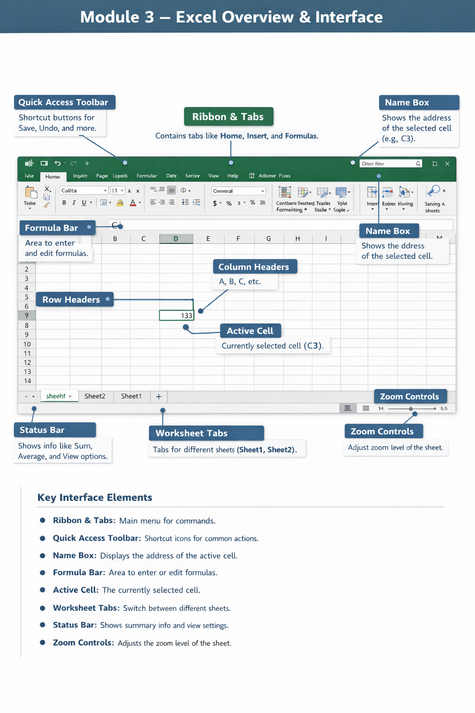

# Module 3 – Excel Overview & Interface

  

## Excel Interface Overview

Microsoft Excel is a spreadsheet application used for data entry, analysis, calculations, and visualization.
Understanding the interface is the first step to working efficiently in Excel.

---

## Workbook Interface Components

### 1. Workbook vs Worksheet

* Workbook

  * The complete Excel file.
  * Example: Budget_2026.xlsx.
  * Acts like a book that holds multiple sheets.

* Worksheet

  * A single sheet inside a workbook.
  * Used to enter and analyze data.
  * You can add more sheets using the plus icon.

---

### 2. Ribbon and Tabs

* Ribbon

  * The main command area at the top.
  * Contains all Excel tools.

* Tabs

  * Examples: File, Home, Insert, Page Layout, Formulas.
  * Each tab groups related commands.

* Purpose

  * Helps you access formatting, formulas, charts, and tools.

---

### 3. Quick Access Toolbar

* Location

  * Top-left corner of Excel.

* Purpose

  * Provides quick access to common commands.
  * Examples: Save, Undo, Redo.

* Benefit

  * Works across all tabs.

---

### 4. Status Bar

* Location

  * Bottom of the Excel window.

* Purpose

  * Shows worksheet status.
  * Displays Sum, Average, Count when cells are selected.
  * Controls zoom and view modes.

---

### 5. Name Box

* Location

  * Left side of the Formula Bar.

* Purpose

  * Displays the address of the active cell.
  * Example: C3.
  * Used to jump directly to a cell by typing its address.

---

### 6. Formula Bar

* Location

  * Below the Ribbon.

* Purpose

  * Used to enter or edit data and formulas.
  * Shows the actual formula instead of the result.

* Example

  * Cell shows 10.
  * Formula Bar shows =5+5.

---

## Navigating the Grid

### 7. Rows and Columns

* Rows

  * Horizontal lines.
  * Identified by numbers.

* Columns

  * Vertical lines.
  * Identified by letters.

---

### 8. Row Headers and Column Headers

* Row Headers

  * Grey boxes on the left.
  * Selects the entire row.

* Column Headers

  * Grey boxes at the top.
  * Selects the entire column.

---

### 9. Cell, Cell Address, and Active Cell

* Cell

  * Intersection of a row and a column.
  * Basic unit of data entry.

* Cell Address

  * Combination of column letter and row number.
  * Example: B5.

* Active Cell

  * Currently selected cell.
  * Highlighted with a green border.
  * Data entry happens here.

---

## Customizing the Interface

### Hide or Unhide Ribbon

* Double-click any tab name.
* Frees screen space.

### Add or Remove Quick Access Toolbar Items

* Click the drop-down arrow on QAT.
* Select required commands.

### Add a Custom Tab

* Right-click any Ribbon tab.
* Select Customize the Ribbon.
* Create a new tab and add tools.
